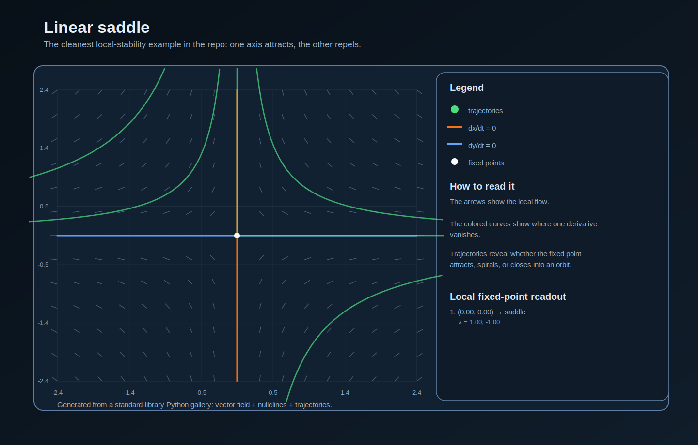
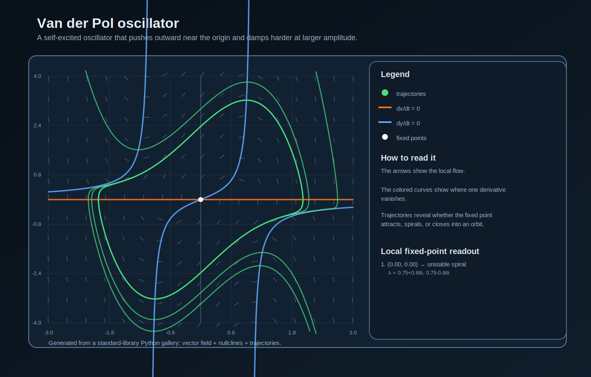
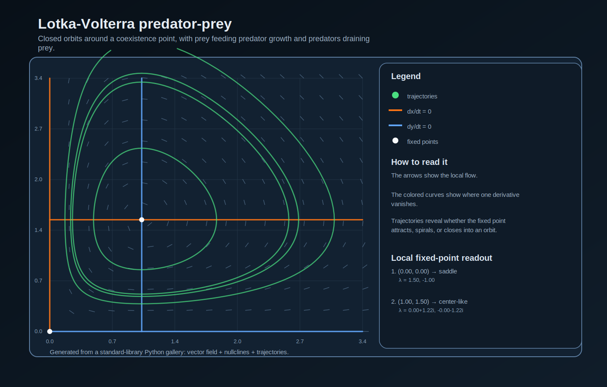
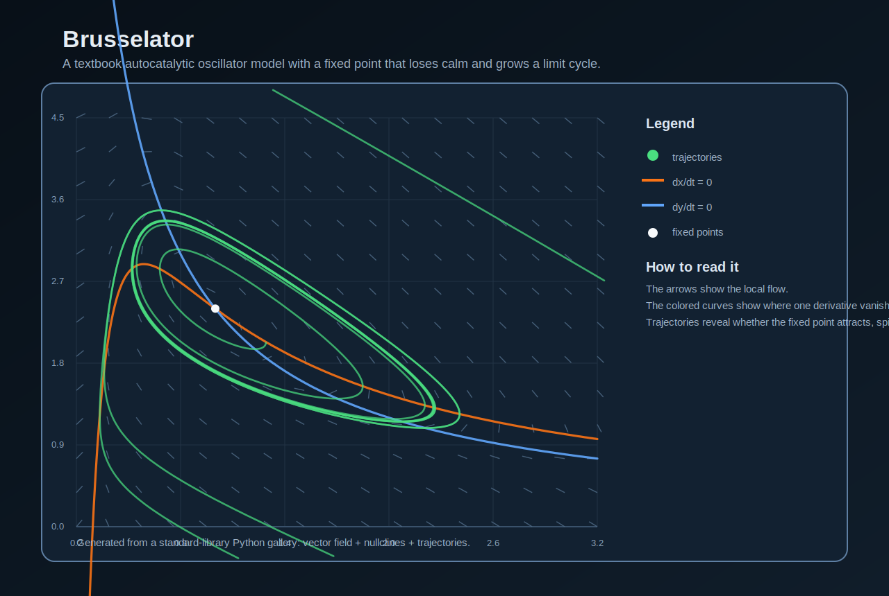
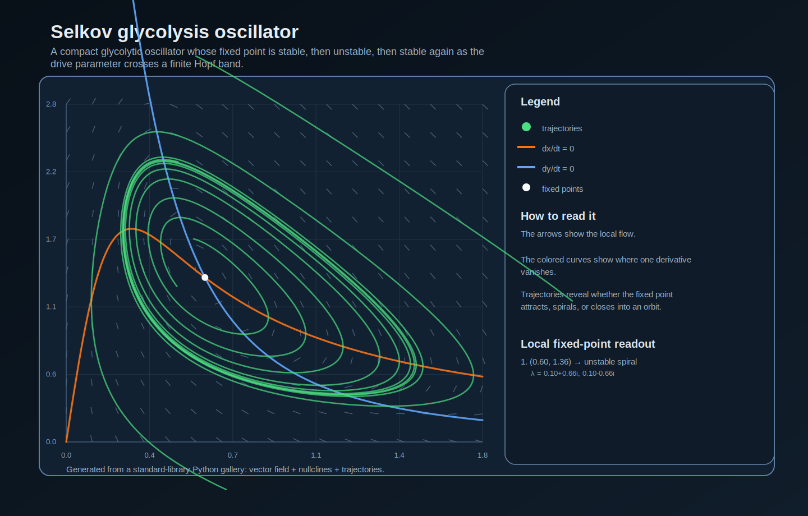
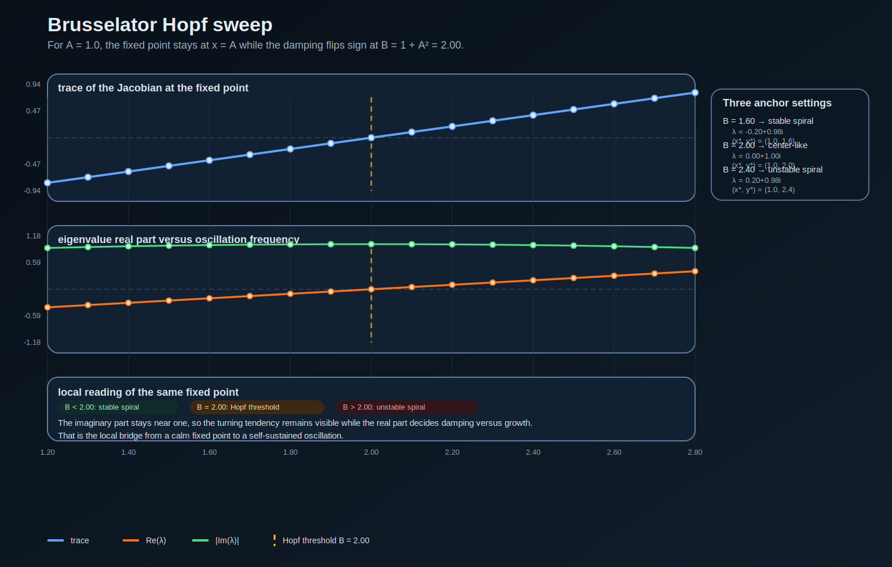
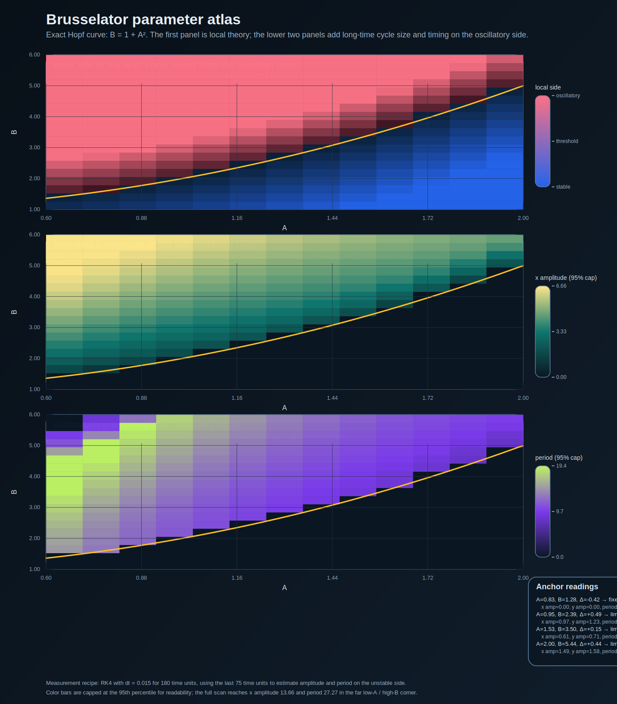
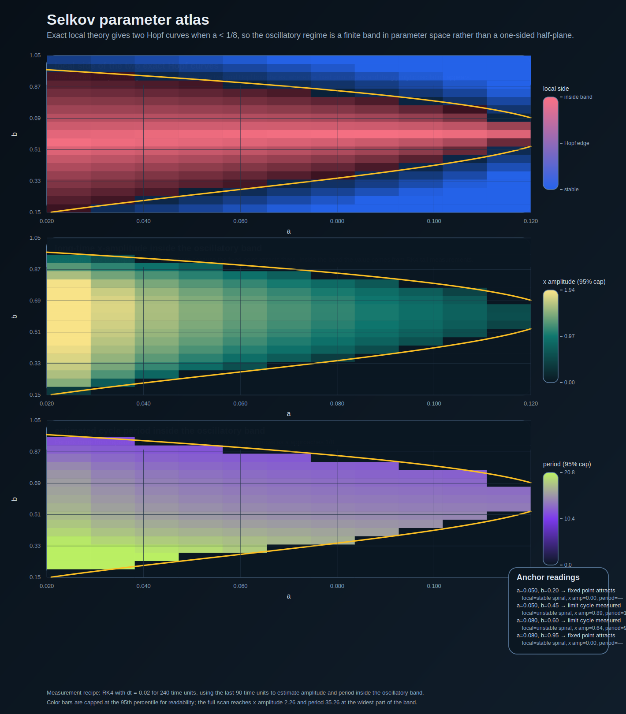

# phase-portrait-lab

A tiny public lab for planar dynamical systems.

The point is simple: generate phase portraits that are worth looking at, not just mention the system names and move on.

This repo now opens with five small case studies:

- **Linear saddle** for the cleanest stable-manifold versus unstable-manifold picture
- **Van der Pol** for self-excited oscillation
- **Lotka-Volterra** for predator-prey cycling
- **Brusselator** for a compact reaction-kinetics oscillator
- **Selkov** for a glycolytic oscillator with a finite oscillatory band

Each portrait combines four things in one figure:

- local flow arrows
- nullclines
- seeded trajectories
- fixed points

The latest pass adds a local-stability layer too:

- fixed-point classification from the Jacobian
- eigenvalue readouts in the SVG side panel
- a CLI report for system-by-system local behavior

The chemistry passes now make that local story slower and more explicit:

- a generated Brusselator Hopf-sweep card that shows where the fixed point stops damping and starts repelling
- a generated two-parameter Brusselator atlas that separates exact local stability from measured cycle amplitude and period
- a generated Selkov atlas that shows a different chemistry geometry: a finite oscillatory band bounded by two exact Hopf curves
- a generated comparison report that puts the Brusselator's one-sided oscillatory region next to the Selkov model's stable → oscillatory → stable window
- companion notebooks on the gallery tour, the local-linearization pass, and the broader `A`-`B` parameter map
- generated reports with sampled tables, formulas, and caveats about what is exact versus what is numerically estimated

That makes the chemistry lane more useful than a bare vector field and lighter than a full notebook-only treatment.

## Why this repo is worth opening

- pure Python, no plotting stack required
- generated SVGs, so the output stays sharp in the browser
- a small library shape instead of one throwaway script
- companion notebooks for the gallery tour, the local-linearization pass, and the Brusselator parameter atlas
- two chemistry atlases plus a comparison report instead of a one-model story
- tests that check the fixed points, the RK4 stepper, and the chemistry measurement layers

## Gallery

### Linear saddle



### Van der Pol oscillator



### Lotka-Volterra predator-prey



### Brusselator



### Selkov glycolysis oscillator



### Brusselator Hopf sweep



### Brusselator parameter atlas



### Selkov parameter atlas



## Quick start

```bash
python3 scripts/generate_gallery.py
python3 -m unittest discover -s tests
python3 -m phaseportraitlab.cli linear-saddle lotka-volterra
```

The gallery build also refreshes `reports/brusselator-hopf-sweep.md`, `reports/brusselator-parameter-atlas.md`, `reports/selkov-parameter-atlas.md`, and `reports/chemical-oscillator-comparison.md`.

## Notebook

See `notebooks/phase_portrait_tour.ipynb` for the gallery walkthrough, `notebooks/local_linearization_and_hopf.ipynb` for the slower pass on Jacobians, trace, and the Brusselator Hopf threshold, and `notebooks/brusselator_parameter_atlas.ipynb` for the first chemistry-facing `A`-`B` parameter study.

## Repo layout

- `phaseportraitlab/systems.py` defines the system catalog
- `phaseportraitlab/integrate.py` holds the RK4 integrator
- `phaseportraitlab/analysis.py` builds vector fields, trajectories, and Jacobian-based fixed-point analysis
- `phaseportraitlab/brusselator_sweep.py` scans the Brusselator across `B`, renders the Hopf card, and writes the sweep report
- `phaseportraitlab/brusselator_atlas.py` builds the two-parameter Brusselator atlas and estimates post-threshold amplitude/period on the oscillatory side
- `phaseportraitlab/selkov_atlas.py` builds a second chemistry atlas where the oscillatory regime is a finite band instead of a one-sided half-plane
- `phaseportraitlab/chemistry_comparison.py` writes the side-by-side comparison note for the two chemistry models
- `phaseportraitlab/cli.py` prints fixed-point classifications and eigenvalue hints
- `phaseportraitlab/svg.py` renders the portraits
- `phaseportraitlab/gallery.py` writes the asset set
- `scripts/generate_gallery.py` rebuilds the gallery
- `reports/brusselator-hopf-sweep.md`, `reports/brusselator-parameter-atlas.md`, `reports/selkov-parameter-atlas.md`, and `reports/chemical-oscillator-comparison.md` are the generated science notes
- `tests/test_systems.py` runs the verification pass
- `notebooks/phase_portrait_tour.ipynb`, `notebooks/local_linearization_and_hopf.ipynb`, and `notebooks/brusselator_parameter_atlas.ipynb` are the companion science notebooks

## Next useful moves

- add one report mode that compares fixed-point types across several systems at once
- add one nonlinear saddle-style example where the manifolds curve instead of staying perfectly straight
- add one local-to-global note that explains where Jacobian predictions stop and finite-time orbit measurements begin now that two chemistry models are in play
